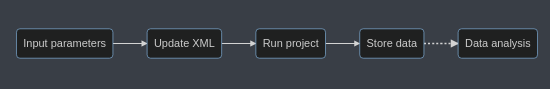

# PhysiCOOL: A generalized framework for model Calibration and Optimization Of modeLing projects

Once you have a compiled PhysiCell file, you can use it as a **black box** to see how the model changes in response to variations in the input values. In this repository, we present some Python-based routines that you can apply to your own research. 

## Basic workflow

For simple studies, it is possible to run studies by simply modifying the XML configuration file. 
You will then need to run the compiled PhysiCell file and store your data, which you can use to perform some data analysis.

For more information on each of these steps, check out the `tutorial.md` file.

## Creating an optimization black-box model

The `OptModel` class creates a black-box function for your PhysiCell project. `OptModel` **takes in a parameters dictionary**, **runs a PhysiCell simulation** with the updated parameter values and then **computes the metric you select** when initializing the model. It outputs an array with the values for the metric you choose.

### Defining variables

`PhysiCOOL` will help you interact with the XML file. You can use a simple representation, and `PhysiCOOL` will convert it to the format used by the config file.

- **cell variables**: `cell/{parameter_name}`
- **microenvironment variables**: `me/{substance}:{parameter_name}`
- **custom variables** : `{parameter_name}`

*Strings are fixed, except for the values between {}, which should be chosen to fit the parameters.*

## PhysiCOOL's multilevel parameter sweep

The `MultiSweep` class will let you run a **multilevel parameter sweep in which the parameter bounds are iteratively adapted based on the minimum value found at each level**. To create it, you must **select the model you want to run at each level** (our `OptModel` blackbox), as well as the **target data** you want to use.

Additionally, you can tune the **number of levels**, and the **number of points and ranges to explore at each level**. Additionally, you can define parameter bounds.

## Examples

### ODE toy model
`ode-toy-model.ipynb` guides you through a simple multilevel sweep example that considers logistic growth.

### Motility study using PhysiCOOL's multilevel parameter sweep

Study the effect of the cell migration bias and migration speed in the presence of a chemotactic gradient.

### Calling external libraries

`psweeo_example.ipynb` will show you how you can build a pipeline to run parameter studies using [psweep](https://pypi.org/project/psweep/). The workflow can be adapted to use other parameter testing algorithms.

