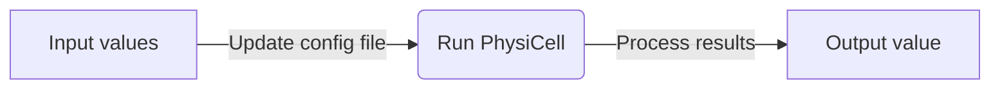

# PhysiCOOL: A generalized framework for model Calibration and Optimization Of modeLing projects


[](https://physicool.readthedocs.io/en/latest/?badge=latest)
[](https://mybinder.org/v2/gh/IGGoncalves/PhysiCOOL/HEAD?urlpath=%2Ftree%2Fexamples)

PhysiCOOL aims to be a generalized framework for **model calibration in PhysiCell**. PhysiCell projects can be used a **black-box** to characterize how the model outputs change in response to variations in the input values. With this in mind, PhysiCOOL introduces a **model-agnostic calibration workflow** that easily integrates with PhysiCell models, and that allows users to **find the best set of parameters for their study**.

PhysiCOOL provides new functions that allow users to easily specify the parameters to vary, as well as the metrics to be quantified (i.g., number of cells through time, total traveled distance,...). Check our [documentation](https://physicool.readthedocs.io) for some examples.

## Instalation

PhysiCOOL is available through pip. You can download it with the following command:

```sh
pip install physicool
```

## Usage

### PhysiCell as a black-box model

PhysiCOOL lets you connect PhysiCell models to Python-based parameter estimation and calibration scripts. To do this, PhysiCOOL helps you convert PhysiCell models into a black-box function that implements the workflow presented below:



Both the functions that update the config file and that process the results data can be defined by the user.

### 🏗️ Multilevel parameter sweep

The `MultiSweep` class will let you run a **multilevel parameter sweep in which the parameter bounds are iteratively adapted based on the minimum value found at each level**. To create it, you must **select the model you want to run at each level** as well as the **target data** you want to use. Additionally, you can tune the **number of levels**, and the **number of points and ranges to explore at each level**. Additionally, you can define parameter bounds.

### Other utilities

PhysiCOOL implements a file parser (`ConfigFileParser`) that lets you read and write data to the PhysiCell XML configuration file with simple Python commands.

## Examples

You can run our examples on [Binder](https://mybinder.org/v2/gh/IGGoncalves/PhysiCOOL/HEAD?urlpath=%2Ftree%2Fexamples)!

- **Interactive parameter estimation example:**
Guides you through a simple example of logistic growth to showcase how the multilevel sweep works.

- 🏗️ **Single-cell motility:**
Studies the effect of the migration bias and migration speed in the presence of a chemotactic gradient.

- 🏗️ **Cell growth:**
Studies the effect of the cell cycling rates on population growth. It also introduces gradient-based approaches.

- 🏗️ **Data analysis and visualization:**
Examples of data visualization scripts, including interactive examples with Jupyter Widgets.

## Team

Tool developed by Inês Gonçalves, David Hormuth, Caleb Phillips, Sandhya Prabhakaran. Runner-up team of the "Best Tool" prize at [PhysiCell 2021 Workshop & Hackaton](http://physicell.org/ws2021/#apply). GO TEAM 7!

## Credits

`PhysiCOOL` was created with [`cookiecutter`](https://cookiecutter.readthedocs.io/en/latest/) and the `py-pkgs-cookiecutter` [template](https://github.com/py-pkgs/py-pkgs-cookiecutter).
