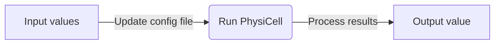

# PhysiCOOL: A generalized framework for model Calibration and Optimization Of modeLing projects


[](https://physicool.readthedocs.io/en/latest/?badge=latest)
[](https://mybinder.org/v2/gh/IGGoncalves/PhysiCOOL/HEAD?urlpath=%2Ftree%2Fexamples)

PhysiCOOL aims to be a generalized framework for **parameter exploration and model calibration in PhysiCell**. Using this library, PhysiCell projects can be used as a **black-box** to characterize how the model outputs change in response to variations in the input values. PhysiCOOL provides new functions to easily update configuration files and change parameter values. It also provides functions to process and visualize simulation outputs (i.g., number of cells through time, total traveled distance,...). 

Check our [documentation](https://physicool.readthedocs.io) for some examples.

## Instalation

PhysiCOOL is available through pip. You can download it with the following command:

```sh
pip install physicool
```

## Usage

### PhysiCell as a black-box model

PhysiCOOL lets you connect PhysiCell models to Python-based parameter estimation and calibration scripts. To do this, PhysiCOOL helps you convert PhysiCell models into a black-box script:



Both the functions that update the config file and that process the results data can be defined by the user.

### Multilevel parameter sweep

The `MultiSweep` class exemplifies how PhysiCOOL can be used to calibrate models using some target data. It enables users to run a multilevel parameter sweep to find the parameter values that fit the target data. To do so, the parameter bounds are iteratively adapted based on the best parameter values found at each level. Users can choose **which parameters to vary** and their initial values, as well as the **number of levels** and the **number of points and ranges to explore at each level**. Parameter bounds can also be defined.

### Other utilities

PhysiCOOL implements a file parser (`ConfigFileParser`) that lets you read and write data to the PhysiCell XML configuration file with simple Python commands.

## Examples

You can run our examples that don't require PhysiCell on [Binder](https://mybinder.org/v2/gh/IGGoncalves/PhysiCOOL/HEAD?urlpath=%2Ftree%2Fexamples)!

- **Interactive parameter estimation example:**
A simple example of logistic growth to showcase how the multilevel sweep works.

- **Data analysis and visualization:**
Examples of data visualization scripts, including interactive examples with Jupyter Widgets.

### MultiSweep examples

Examples to run with PhysiCell models:

- 🏗️ **Single-cell motility:**
Finding the best parameter values for migration bias and migration speed to model motility in the presence of a chemotactic gradient.

- 🏗️ **Cell growth:**
Finding the best parameter values for cell cycling rates to model population growth. It also introduces gradient-based approaches.

## Team

Tool developed by Inês Gonçalves, David Hormuth, Caleb Phillips, Sandhya Prabhakaran. Runner-up team of the "Best Tool" prize at [PhysiCell 2021 Workshop & Hackaton](http://physicell.org/ws2021/#apply). GO TEAM 7!

## Credits

`PhysiCOOL` was created with [`cookiecutter`](https://cookiecutter.readthedocs.io/en/latest/) and the `py-pkgs-cookiecutter` [template](https://github.com/py-pkgs/py-pkgs-cookiecutter).
