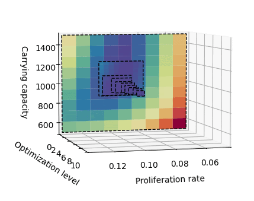
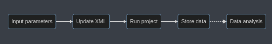

# PhysiCOOL: A generalized framework for model Calibration and Optimization Of modeLing projects

PhysiCOOL aims to be a generalized framework for **model calibration in PhysiCell**. PhysiCell projects can be used a **black-box** to characterize how the model outputs change in response to variations in the input values. With this in mind, PhysiCOOL introduces a **model-agnostic calibration workflow** that easily integrates with PhysiCell models, and that allows users to **find the best set of parameters for their study**. 

PhysiCOOL provides new functions that allow users to easily specify the parameters to vary, as well as the metrics to be quantified (i.g., number of cells through time, total traveled distance,...). Currently, our algorithm relies on the existence of some target data, provided by the user, which will be used to fit the model. 

## Creating an optimization black-box model
The `OptModel` class creates a black-box function for your PhysiCell project. `OptModel` **takes in a parameters dictionary**, **runs a PhysiCell simulation** with the updated parameter values and then **computes the metric you select** when initializing the model. It outputs an array with the values for the metric you choose.

### Defining variables

`PhysiCOOL` will help you interact with the XML file. You can use a simple representation, and `PhysiCOOL` will convert it to the format used by the config file.

- **cell variables**: `cell/{parameter_name}`
- **microenvironment variables**: `me/{substance}:{parameter_name}`
- **custom variables** : `{parameter_name}`

*Strings are fixed, except for the values between {}, which should be chosen to fit the parameters.*

## PhysiCOOL's multilevel parameter sweep

The `MultiSweep` class will let you run a **multilevel parameter sweep in which the parameter bounds are iteratively adapted based on the minimum value found at each level**. To create it, you must **select the model you want to run at each level** (our `OptModel` blackbox), as well as the **target data** you want to use.

Additionally, you can tune the **number of levels**, and the **number of points and ranges to explore at each level**. Additionally, you can define parameter bounds.

## Examples

- **ODE toy model:**
Guides you through a simple example of logistic growth to showcase how the multilevel sweep works. (test it on Binder!)

- **Single-cell motility:**
Studies the effect of the migration bias and migration speed in the presence of a chemotactic gradient.

- **Cell growth:**
Studies the effect of the cell cycling rates on population growth. It also introduces gradient-based approaches.

- **Calling external libraries**
Shows how you can build a pipeline to run parameter studies using external libraries, in particular [psweep](https://pypi.org/project/psweep/). The workflow can be adapted to other tools.

- **Data analysis and visualization:**
TBA

## Team

Tool developed by Inês Gonçalves, David Hormuth, Caleb Phillips, Sandhya Prabhakaran. Runner-up team of the "Best Tool" prize at [PhysiCell 2021 Workshop & Hackaton](http://physicell.org/ws2021/#apply).
