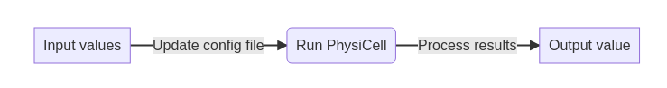

<div align="center">

<h1>PhysiCOOL: A generalized framework for model Calibration and Optimization Of modeLing projects</h1>

<a href=""></a>
<a href="">[](https://physicool.readthedocs.io/en/latest/?badge=latest)</a>
<a href=""></a>
<a href="">[](https://zenodo.org/badge/latestdoi/396329798)</a>
<a href="">[](https://mybinder.org/v2/gh/IGGoncalves/PhysiCOOL/HEAD?urlpath=%2Ftree%2Fexamples)</a>
<a href="">[](https://github.com/psf/black)</a>

</div>

## Overview

PhysiCOOL is a Python library tailored to perform model calibration studies with 
[PhysiCell](https://github.com/MathCancer/PhysiCell). 
Using the PhysiCOOL package, PhysiCell projects can be converted into black-box models to evaluate how simulation outputs
change in response to variations in input values. PhysiCOOL takes advantage of Python's popularity and simplicity to
make PhysiCell studies more accessible and enables users to integrate Python-based calibration tools with their PhysiCell
workflows.

Although PhysiCOOL was designed to create full model calibration workflows, its components can be used independently 
according to the users' needs. For instance,this novel package implements a file parser that enables users to read and 
write data to the PhysiCell XML configuration file using simple Python commands. Data validation is performed when 
new information is written to the files, assuring that the new values are consistent with PhysiCell's requirements 
and assumptions. Furthermore, PhysiCOOL also provides new functions to process and visualize simulation outputs which 
can be used for both parameter exploration and model calibration.

Check our [documentation](https://physicool.readthedocs.io) for some examples.

## Installation

PhysiCOOL is available through pip using the following command:

```sh
pip install physicool
```

## Usage

### Writing data to the XML configuration file

The parameters used by PhysiCell in a new simulation are defined in a configuration file with an XML structure. 
While it is possible to use built-in Python functions to modify these scripts, it is required to know their 
structure and write new code to change different parameters. PhysiCOOL aims to simplify this process by letting 
users select the parameters to be changed based on PhysiCell's data structures with Python objects:

```python
from physicool.config import ConfigFileParser
# Parse the data from the config file
xml_data = ConfigFileParser("config/PhysiCell_settings.xml")
# Read the cell parameters for the "default" cell definition
cell_data = xml_data.read_cell_data("default")
# Update and write the new parameters to the config file
cell_data.motility.bias = 0.5
xml_data.write_cell_params(cell_data=cell_data)
```

Another important PhysiCOOL component is data validation, which is not available through standard XML libraries. 
For instance, in this code snippet, PhysiCOOL automatically checks if the new migration bias value is between 0 and 1, 
as it is defined by PhysiCell that this parameter should be inside this range.

### PhysiCell as a black-box model

Parameter estimation and model calibration can be achieved by assuming that a model behaves as a black-box. 
In other words, the information about the model itself can be disregarded and only the inputs and outputs are 
considered during calibration. PhysiCOOL allows users to connect their PhysiCell compiled scripts to Python-based 
functions in order to create a black-box model with three main components:

- A function that updates the PhysiCell configuration file with new input parameters values;
- The PhysiCell model;
- A function that reads the model outputs and computes the desired output metric.

These black-box models are modular in the sense that the users can select what functions to use to update the 
configuration file and to process the results. For instance, users can decide to change the cells' motility parameters 
and evaluate the effect on the distance traveled by cells over time. Alternatively, the cell cycling rates could be 
varied to analyze the evolution of the number of cells.



### Multilevel parameter sweep

The `MultiSweep` class exemplifies how PhysiCOOL can be used to calibrate models using some target data. 
It enables users to run a multilevel sweep using black-box models to find the parameter values that fit the target 
data by iteratively adapting and fitting the parameter space. To do so, at each level, the parameter space is sampled
and value combinations are chosen. Simulations are run for all possible iterations and the results are processed to 
find the similarity between the models outputs and the target data. Subsequently, the values that produced the best 
set of results are chosen and the parameter bounds are adapted to converge to the local solution, as shown in the 
animation below.

Users can choose **which parameters to vary** and their initial values, as well as the **number of levels** and 
the **number of points and ranges to explore at each level**.

## Examples

### General examples

You can run our examples that don't require PhysiCell on 
[Binder](https://mybinder.org/v2/gh/IGGoncalves/PhysiCOOL/HEAD?urlpath=%2Ftree%2Fexamples)!

- **Interactive parameter estimation example:**
A simple example of logistic growth to showcase the multilevel sweep feature.

- **Data analysis and visualization:**
Examples of data visualization scripts, including interactive examples with Jupyter Widgets.

### MultiSweep examples

Examples to run with PhysiCell models:

- **Single-cell motility:**
Finding the best parameter values for migration bias and migration speed to model motility in the presence 
of a chemotactic gradient.

- 🏗️ **Cell growth:**
Finding the best parameter values for cell cycling rates to model population growth. It also introduces 
gradient-based approaches.

## Team

Tool developed by Inês Gonçalves, David Hormuth, Caleb Phillips, Sandhya Prabhakaran. 
Runner-up team of the "Best Tool" prize at [PhysiCell 2021 Workshop & Hackaton](http://physicell.org/ws2021/#apply). 
GO TEAM 7!

## Credits

`PhysiCOOL` was created with [`cookiecutter`](https://cookiecutter.readthedocs.io/en/latest/) 
and the `py-pkgs-cookiecutter` [template](https://github.com/py-pkgs/py-pkgs-cookiecutter).
