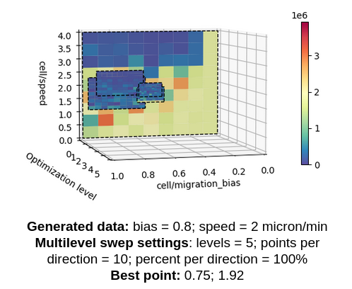
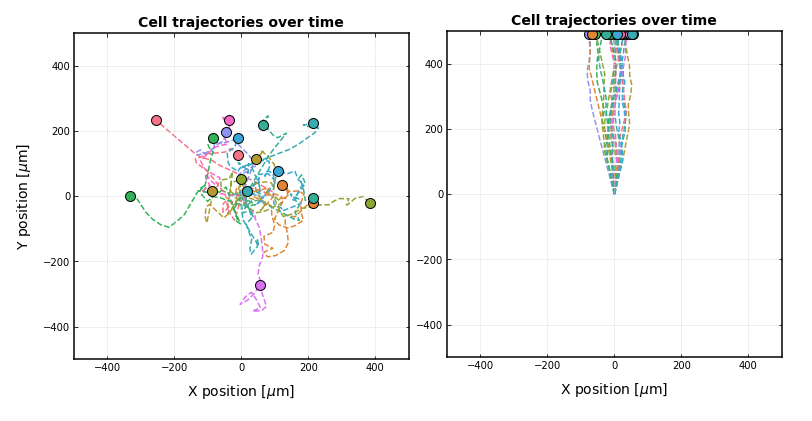
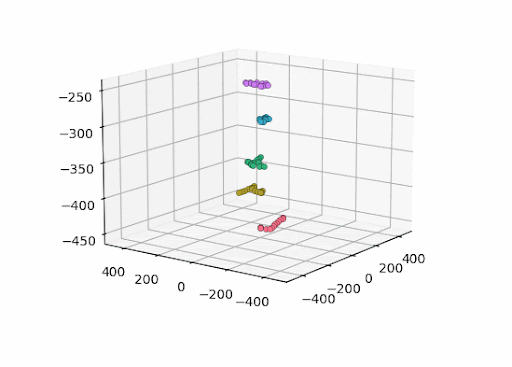

# Single-cell motility optimization (considering chemotaxis)

## Goal
Predict the role of the **cell migration speed** and the **migration bias** to model single-cell chemotaxis.

## Setup
We define an **oxygen gradient** by setting a boundary condition with high oxygen levels at the top of the domain, and defining lower oxygen levels at the rest of the domain through the initial conditions. Thus, it is expected that **cells with a low migration bias will migrate randomly** (as shown in the image on the left), and **cells with higher migration bias will follow the generated gradient** (right image).

We consider a **stacked set of 2D replicates inside of each simulation**. Each cell is placed at a defined height value inside of a 3D domain domain, but only 2D migration and 2D are enabled, as shown in the figure below.

## Files needed to compile the PhysiCell project
The `custom` files found in this repository can be used to compile the PhysiCell project. The `config` file should be used to run the simulations.